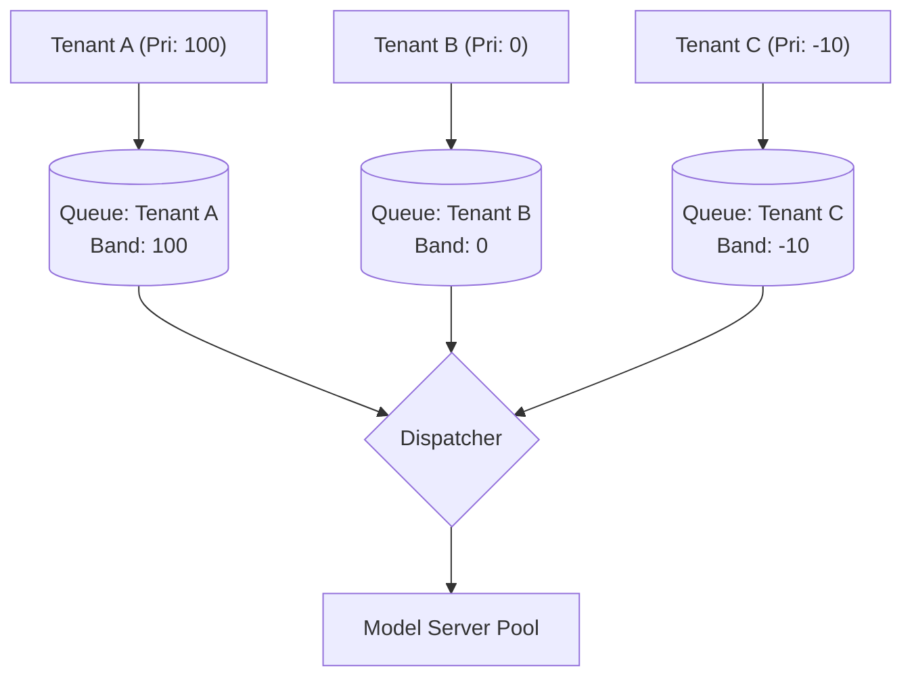

# [Experimental] Flow Control

## Overview

Flow Control enables intelligent request queuing at the llm-d Router level. Traditional load balancing falls short for LLMs because resource consumption varies wildly per request. Shifting queuing to the Router enables:

* **Multi-Tenancy**: Prevent noisy neighbors from starving others and enforce fairness between tenants.
* **No-Regret Scheduling**: Hold requests during peak saturation instead of committing them to a server's local queue where they become stuck.

### How it Works

Incoming requests are classified by a `FlowKey` (Fairness ID + Priority). EPP maintains separate in-memory queues for each flow and dispatches them based on:

1. **Priority**: Servicing highest priority bands first.
2. **Fairness**: Cycling through tenants within a band.
3. **Ordering**: Ordering requests within a flow.

*While Backpressure protects the physical hardware from overload, the Multi-Tenancy policies dictate exactly how that delayed traffic is ordered and distributed among your users.*

The following diagram illustrates the centralized queuing topology:



## Default Configuration

The following default hardware configuration is inherited from the [Optimized Baseline](../optimized-baseline/README.md):

| Parameter          | Value                                                   |
| ------------------ | ------------------------------------------------------- |
| Model              | [Qwen/Qwen3-32B](https://huggingface.co/Qwen/Qwen3-32B) |
| Replicas           | 8                                                       |
| Tensor Parallelism | 2                                                       |
| GPUs per replica   | 2                                                       |
| Total GPUs         | 16                                                      |

When the `flowControl` feature gate is enabled, the EPP uses the following policies by default. These defaults are explicitly designed to mimic legacy, non-flow-control behavior (Strict FCFS) to ensure a seamless transition for existing workloads.

| Policy Type | Default Plugin | Description |
| :--- | :--- | :--- |
| **Fairness** | `global-strict-fairness-policy` | Ignores flow isolation and serves all requests in a single global order. |
| **Ordering** | `fcfs-ordering-policy` | First-Come, First-Served based on arrival time. |
| **Saturation** | `utilization-detector` | Closed-loop detector reacting to real-time telemetry. |

> [!NOTE]
>
> * Beneath the flow control layer, this guide uses the exact same `prefix-cache-scorer` and `load-aware` routing policies established in the [Optimized Baseline](../optimized-baseline/README.md). Flow control acts as an intelligent ingress layer that holds saturated traffic *before* it passes to the scheduler.
> * While `utilization-detector` is the out-of-the-box system default listed here, production deployments should switch to `concurrency-detector` to avoid telemetry lag risks, as detailed in the [Tuning Guide](tuning.md).

By default, the EPP uses a `global-strict` policy. Because the system is **work-conserving**, it will never artificially throttle traffic if GPUs have spare capacity. However, enforcing strict fairness (like Round-Robin) during periods of saturation constrains the scheduler's ability to pick the globally optimal request for batching or cache reuse, thereby bounding the maximum explorable latency-throughput frontier. The default prioritizes absolute global throughput, while this guide overrides it to prioritize tenant equity.

### Supported Hardware Backends

Flow Control is a software-level scheduling feature at the EPP layer and is entirely hardware-agnostic. It supports all accelerators detailed in the [Optimized Baseline guide](../optimized-baseline/README.md#supported-hardware-backends). Since this guide builds exactly on top of that baseline, we will dynamically deploy the baseline's model servers in the steps below rather than maintaining duplicate configurations.

## Prerequisites

* Have the [proper client tools installed on your local system](../../helpers/client-setup/README.md) to use this guide.
* Checkout llm-d repo:

  ```bash
  export branch="main" # branch, tag, or commit hash
  git clone https://github.com/llm-d/llm-d.git && cd llm-d && git checkout ${branch}
  ```

* Set the following environment variables:

  ```bash
  export GAIE_VERSION=v1.5.0
  export GUIDE_NAME="flow-control"
  export NAMESPACE="llm-d-flow-control"
  export MODEL_NAME="Qwen/Qwen3-32B"
  ```

* Install the Gateway API Inference Extension CRDs:

  ```bash
  kubectl apply -k "https://github.com/kubernetes-sigs/gateway-api-inference-extension/config/crd?ref=${GAIE_VERSION}"
  ```

* Create a target namespace for the installation:

  ```bash
  kubectl create namespace ${NAMESPACE}
  ```

## Installation Instructions

### 1. Deploy the Inference Scheduler

#### Standalone Mode

This deploys the inference scheduler with an Envoy sidecar, it doesn't set up a Kubernetes Gateway.

```bash
helm install ${GUIDE_NAME} \
    oci://registry.k8s.io/gateway-api-inference-extension/charts/standalone \
    -f guides/recipes/scheduler/base.values.yaml \
    -f guides/${GUIDE_NAME}/scheduler/${GUIDE_NAME}.values.yaml \
    -n ${NAMESPACE} --version ${GAIE_VERSION}
```

<details>
<summary><h4>Gateway Mode</h4></summary>

To use a Kubernetes Gateway managed proxy rather than the standalone version, follow these steps instead of applying the previous Helm chart:

1. *Deploy a Kubernetes Gateway* named by following one of [the gateway guides](../prereq/gateways).
2. *Deploy the inference scheduler and an HTTPRoute* that connects it to the Gateway as follows:

```bash
export PROVIDER_NAME=gke # options: none, gke, agentgateway, istio
helm install ${GUIDE_NAME} \
    oci://registry.k8s.io/gateway-api-inference-extension/charts/inferencepool  \
    -f guides/recipes/scheduler/base.values.yaml \
    -f guides/${GUIDE_NAME}/scheduler/${GUIDE_NAME}.values.yaml \
    --set provider.name=${PROVIDER_NAME} \
    --set experimentalHttpRoute.enabled=true \
    --set experimentalHttpRoute.inferenceGatewayName=llm-d-inference-gateway \
    -n ${NAMESPACE} --version ${GAIE_VERSION}
```

</details>

### 2. Deploy the Model Server

Instead of maintaining duplicate hardware configurations, we dynamically render the model server manifests from the `optimized-baseline` guide and inject the `flow-control` guide labels using `sed`.

Deploy the model server (defaulting to NVIDIA GPU / vLLM) by running:

```bash
kubectl kustomize guides/optimized-baseline/modelserver/gpu/vllm/ \
  | sed "s/optimized-baseline/${GUIDE_NAME}/g" \
  | kubectl apply -n ${NAMESPACE} -f -
```

### 3. Enable monitoring (optional)

> [!NOTE]
> GKE provides [automatic application monitoring](https://docs.cloud.google.com/kubernetes-engine/docs/how-to/configure-automatic-application-monitoring) out of the box. The llm-d [Monitoring stack](../../docs/monitoring/README.md) is not required for GKE, but it is available if you prefer to use it.

* Install the [Monitoring stack](../../docs/monitoring/README.md).
* Deploy the monitoring resources for this guide.

```bash
kubectl apply -n ${NAMESPACE} -k guides/recipes/modelserver/components/monitoring
```

## Verification

### 1. Get the IP of the Proxy

**Standalone Mode**

```bash
export IP=$(kubectl get service ${GUIDE_NAME}-epp -n ${NAMESPACE} -o jsonpath='{.spec.clusterIP}')
```

<details>
<summary> <b>Gateway Mode</b> </summary>

```bash
export IP=$(kubectl get gateway llm-d-inference-gateway -n ${NAMESPACE} -o jsonpath='{.status.addresses[0].value}')
```

</details>

### 2. Basic Verification

Check EPP logs for feature gate activation:

```bash
kubectl logs deploy/${GUIDE_NAME}-epp -n ${NAMESPACE} | grep "Flow Control enabled"
```

### 3. Proof of Queuing

To fully verify that queuing and backpressure are working, you must apply concurrent load. We will demonstrate this using a load generation tool in **Use Case 2** below. For now, set up your test environment.

**Open a temporary interactive shell inside the cluster:**

```bash
kubectl run curl-debug --rm -it \
    --image=cfmanteiga/alpine-bash-curl-jq \
    --env="IP=$IP" \
    --env="NAMESPACE=$NAMESPACE" \
    --env="GUIDE_NAME=$GUIDE_NAME" \
    -- /bin/bash
```

**From inside the debug pod, check the metrics:**

```bash
curl http://${GUIDE_NAME}-epp:9090/metrics | grep inference_extension_flow_control_queue_size
```

## Use Cases

### Use Case 1: Multi-Tenancy (MaaS)

In this use case, we configure 3 priority tiers (Premium, Standard, Best-Effort) and guarantee fairness between tenants within the same tier.

#### 1. Apply InferenceObjectives

The `helm upgrade --install` command you ran earlier configured the EPP's underlying `EndpointPickerConfig` to map queues to priority bands. However, you must explicitly define these bands in the cluster using `InferenceObjective` resources.

Apply the full definitions (Premium, Standard, Best-Effort) provided in [objectives.yaml](./objectives.yaml) by running:

```bash
kubectl apply -f guides/${GUIDE_NAME}/objectives.yaml -n ${NAMESPACE}
```

The file defines three priority tiers:

* **Premium** (priority 100): Highest priority.
* **Standard** (priority 0): Default priority.
* **Best-Effort** (priority -10): Admitted into queue but subject to strict band limits.

#### 2. Client Integration

Clients must send the appropriate headers to be placed in the correct queues.

**From inside the `curl-debug` pod**, send a completion request with headers:

```bash
curl -X POST http://${IP}/v1/completions \
  -H 'Content-Type: application/json' \
  -H 'x-gateway-inference-fairness-id: tenant-a' \
  -H 'x-gateway-inference-objective: premium-traffic' \
  -d "{
    \"model\": \"${MODEL_NAME}\",
    \"prompt\": \"Say hello\"
  }"
```

> [!WARNING]
> **Trust Boundary**: In a production system, allowing end-users to self-assert their tenant ID or traffic priority (`premium-traffic`) is an abuse vector.
>
> **Production Pattern**: Your ingress API Gateway (or an Envoy `ext_authz` filter) should be configured to automatically strip any incoming `x-gateway-*` headers from external traffic. It should then validate the user's API Key or JWT, extract their tier/tenant from the token claims, and securely inject the authoritative `x-gateway-inference-fairness-id` and `x-gateway-inference-objective` headers before passing the request to the EPP.

### Use Case 2: Backpressure Management

Backpressure management protects GPUs from context-thrashing and ensures predictable generation times by holding requests in the EPP when the pool is saturated.

Unlike legacy admission mode which immediately drops negative-priority requests when the pool is full, Flow Control safely buffers them. Load shedding is triggered strictly by memory protection boundaries—meaning a request is only rejected if its specific priority band hits its `maxRequests` limit, OR if the global limits (`maxRequests` or `maxBytes`) are breached.

#### Verification for Use Case 2

To verify backpressure management, you must overwhelm the pool's capacity. Because the system is work-conserving, a single request will dispatch immediately. We will use `hey`, a lightweight HTTP load generator, to instantly fire concurrent requests and trigger saturation.

1. **Download `hey` and create a payload** (from inside the `curl-debug` pod):

    ```bash
    wget https://hey-release.s3.us-east-2.amazonaws.com/hey_linux_amd64 -O /usr/local/bin/hey
    chmod +x /usr/local/bin/hey

    cat <<EOF > payload.json
    {
      "model": "${MODEL_NAME}",
      "prompt": "Say hello"
    }
    EOF
    ```

2. **Fire a Burst of Best-Effort Requests**:

    ```bash
    hey -c 150 -n 150 -m POST -T "application/json" \
      -H "x-gateway-inference-fairness-id: tenant-b" \
      -H "x-gateway-inference-objective: best-effort-traffic" \
      -D payload.json http://${IP}/v1/completions
    ```

3. **Observe Behavior**: While the load is running (or immediately after), these requests should be buffered in the `best-effort` priority band. Open a second terminal or check the metrics quickly to verify:

    ```bash
    curl -s http://${GUIDE_NAME}-epp:9090/metrics | grep 'inference_extension_flow_control_queue_size{priority="-10"}'
    ```

    *You should see a value greater than 0, proving the requests were safely queued.*

4. **Exit the debug shell** once testing is complete to return to your host terminal:

    ```bash
    exit
    ```

## Production Tuning: Deriving `maxConcurrency`

> [!IMPORTANT]
> The `maxConcurrency` value of `132` used in this guide is empirically tuned **only** for the default reference workload (Qwen3-32B on 16 H100s). If you use a different model, hardware, or have different prompt lengths, you **must** calculate your own `maxConcurrency` to prevent GPU starvation or OOMs.

For detailed instructions on how to derive the optimal `maxConcurrency` for your specific workload, see the [Tuning Guide](tuning.md).

## Benchmarking

> [!NOTE]
> Benchmarking for flow control requires specialized setups to demonstrate QoS differentiation and fairness. The standard `inference-perf` tool does not yet support multi-tenant slicing of load stages and metrics. Placeholders for detailed benchmarking reports will be added here in a future release.

## Observability

The Flow Control layer exposes detailed metrics to track queuing dynamics. Please refer to [flow control architecture](../../docs/architecture/core/router/epp/flow-control.md) for more details.

## Cleanup

To remove the deployed components:

```bash
helm uninstall ${GUIDE_NAME} -n ${NAMESPACE}
kubectl delete -f guides/${GUIDE_NAME}/objectives.yaml -n ${NAMESPACE}
kubectl kustomize guides/optimized-baseline/modelserver/gpu/vllm/ \
  | sed "s/optimized-baseline/${GUIDE_NAME}/g" \
  | kubectl delete -n ${NAMESPACE} -f -
```

## Further Reading

See [Flow Control architecture](../../docs/architecture/core/epp/flow-control.md) for full details of the design.
